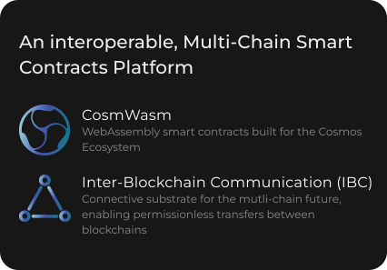

# ✨ About Nibiru

## What is Nibiru?

**Nibiru** is a sovereign proof-of-stake blockchain, open-source platform, and member of a family of interconnected blockchains that comprise the Cosmos Ecosystem. A core blockchain scaling challenge is meeting transaction demand without becoming prohibitively expensive for retail traders. The promise of a multi-chain future has drawn interest towards Cosmos as an infinitely scalable solution to this problem. However, the ecosystem currently lacks tools for investing with complex financial positions.

Nibiru unifies leveraged derivatives trading, spot trading, staking, and bonded liquidity provision into a seamless user experience, enabling users of over 40 blockchains to trade with leverage using a suite of composable decentralized applications.

Nibiru accurately prices assets using a system of front-run resistant [oracles](content/price-feed-oracles.md), and communicates with other Cosmos layer-1 chains using the [Inter-Blockchain Communication (IBC)](https://github.com/cosmos/ibc) protocol.

The security of the Nibiru blockchain relies on a set of validators to commit new blocks and participate in Tendermint BFT consensus by brodcasting votes that contain cryptographic signatures signed by each validator's private key. Validators stake **NIBI**, the protocol's native token used for gas, governance, and "mining". Users can delegate NIBI to validators that record and verify transactions in exchange for rewards.

## Nibiru Ecosystem &#x20;


[perps-overview.md](content/perps-overview.md)


A perpetual futures exchange where users can take leveraged exposure and trade on a plethora of assets — completely on-chain, completely non-custodially, and with minimal gas fees.


[amm.md](content/amm.md)


**Nibi-Swap** is an automated market maker protocol for multichain assets. This application gives users access to swaps, pools, and bonded liquidity gauges.


[stablecoin.md](content/stablecoin.md)


Nibiru powers a two-token economic model, where NIBI is the staking and utility token for the protocol and NUSD is a capital-efficient, partially collateralized stablecoin for the protocol.

---

###  CosmWasm Integration 

Nibiru will also act as a permission-less and censorship resistant platform for developers to deploy smart contracts in Go and Rust.

### Inter-Blockchain Communication Protocol (IBC)

Nibiru is IBC compliant at genesis and connected over 40 blockchains. IBC enables secure and permissionless transfers of funds between blockchains in addition to cross-chain computation and transfer of arbitrary data. This includes cross-chain smart contract calls, fee payments, NFTs, and fungible token transfers. IBC is not reliant on a multi-sig or centralized bridging solution.

.svg>)

### [Frequently Asked Questions (FAQ)](learn-more/faq.md)

### Contribution guidelines for this documentation

You can contribute to improve this documentation on [GitHub](https://github.com/NibiruChain/docs) by submitting issues or opening a pull request.
