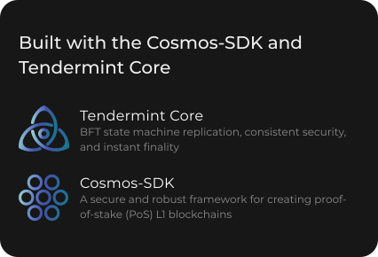

# ✨ About Nibiru

### What is Nibiru?

**Nibiru** is a sovereign proof-of-stake blockchain, open-source platform, and member of a family of interconnected blockchains that comprise the Cosmos Ecosystem. A core blockchain scaling challenge is meeting transaction demand without becoming prohibitively expensive for retail traders. The promise of a multi-chain future has drawn interest towards Cosmos as an infinitely scalable solution to this problem. However, the ecosystem currently lacks tools for investing with complex financial positions.

Nibiru unifies leveraged derivatives trading, spot trading, staking, and bonded liquidity provision into a seamless user experience, enabling users of over 40 blockchains to trade with leverage using a suite of composable decentralized applications.

#### 1. Nibi-Perps

A perpetual futures exchange where users can take leveraged exposure and trade on a plethora of assets — completely on-chain, completely non-custodially, and with minimal gas fees.



#### 2. Nibi-Swap

An automated market maker for multichain assets. This application gives users access to swaps, pools, and bonded liquidity gauges.

#### 3. Nibiru Stablecoin (NUSD)

A two-token economic model, where NIBI is the staking and utility token for the protocol and NUSD is a capital-efficient, partially collateralized stablecoin for the protocol.

## Blockchain Architecture

The security of the Nibiru blockchain relies on a set of validators to commit new blocks and participate in Tendermint BFT consensus by brodcasting votes that contain cryptographic signatures signed by each validator's private key. Validators stake **NIBI**, the protocol's native token used for gas, governance, and "mining". Users stake NIBI to validators that record and verify transactions in exchange for rewards.

Nibiru is built with the [Cosmos-SDK](https://github.com/cosmos/cosmos-sdk), accurately prices assets using a system of front-run resistant oracles, and communicates with other Cosmos layer-1 chains using the [Inter-Blockchain Communication (IBC)](https://github.com/cosmos/ibc) protocol.

### Frequently Asked Questions (FAQ)

* [Nibiru FAQ](faqs/faq.md)
* [Validator FAQ](faqs/validator-faq.md)

### Contribute to this documentation

You can contribute to improve this documentation on [GitHub](https://github.com/NibiruChain/gitbook-docs) by submitting issues or proposing changes.
